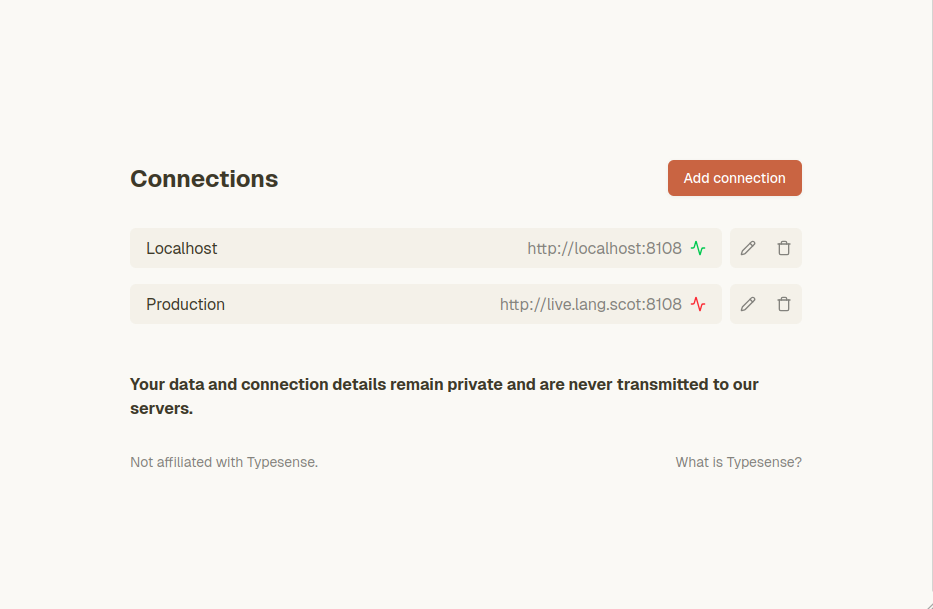
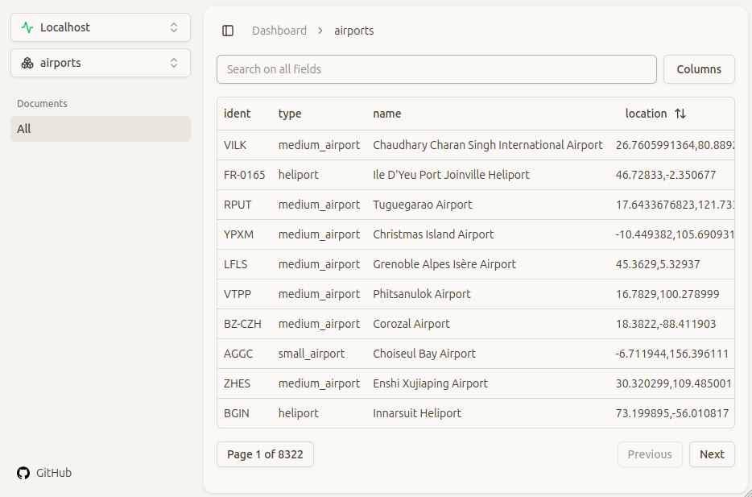

# Typesense UI

A clean, simple, and decluttered Next.js UI for managing Typesense instances. This project provides an intuitive interface for exploring your Typesense collections and documents without the complexity of using the Typesense API directly.

## 📊 Status

This is a learning-focused project currently in active development. While functional for basic use cases (see below), it currently lacks some key features. For a feature complete UI, please check out [Typesense Dashboard](https://github.com/bfritscher/typesense-dashboard) by @bfritscher.

## ✨ Features

- **Multiple Connection Management**: Connect to multiple Typesense instances and switch between them seamlessly
- **Collection Browser**: View all collections in your Typesense database at once
- **Document Data Table**: Browse documents with standard table functionality:
  - **Search**: Search across all string fields in your documents
  - **Pagination**: Navigate through large datasets with configurable page sizes
  - **Sorting**: Sort by any field that supports sorting in Typesense
  - **Column Management**: Show/hide columns to customize your view
- **Clean, Modern UI**: Built with Next.js 15, Tailwind CSS, and ShadCN UI components. Theme inspired by Claude.
- **Privacy-First**: All connections and data remain in your browser - nothing is transmitted to external servers

## 🎯 Motivation

This project was born from two main motivations:

1. **Learning Opportunity**: As I increasingly integrate Typesense into my projects, I wanted to gain better observability and deeper understanding of the API's features and capabilities.

2. **Personal Need**: @bfritscher already built and maintains a great UI for managing Typesense instances, go check it out [here](https://github.com/bfritscher/typesense-dashboard). However, I desired a cleaner UI and have some bespoke requirements for my use cases, see planned features below.

## 🚀 Live Demo

Try the hosted version at: **[https://typesense.lang.scot](https://typesense.lang.scot)**

## Planned Features

These planned features represent the roadmap to v1.0.0. Upon completion, I plan to expand into more advanced functionality focused on improving the feedback loop of optimizing search experiences. In addition, I may pivot or fork this project to add integrations beyond the scope of Typesense. If you have any ideas around this, please let me know!

> [!TIP]
> If you are looking for these features already, please check out [Typesense Dashboard](https://github.com/bfritscher/typesense-dashboard) by @bfritscher.


- **Collection management**: Basic management of collections, including creation, updating, deletion, alias'ing.
- **Synonym/Stopword management**: Basic management of synonyms and stopwords.
- **Curation/overrides management**: Basic management of curation/override rules.
- **Document management**: Basic management of documents, including creation, updating, importing, and deletion.


## 📋 Prerequisites

Before using this UI, ensure your Typesense server has CORS enabled. You can configure this by adding the following parameters to your Typesense server startup:

```bash
--enable-cors
--cors-domains=https://typesense.lang.scot,http://localhost:3000
```

For more details on CORS configuration, see the [Typesense CORS documentation](https://typesense.org/docs/28.0/api/server-configuration.html#cors).

## 🛠️ Installation & Setup (for running locally/self hosting)

### Prerequisites
- Node.js 18+ 
- pnpm (recommended) or npm

### Quick Start

1. **Clone the repository**
   ```bash
   git clone https://github.com/langscot/typesense-ui
   cd typesense-ui
   ```

2. **Install dependencies**
   ```bash
   pnpm install
   # or
   npm install
   ```

3. **Run the development server**
   ```bash
   pnpm dev
   # or
   npm run dev
   ```

4. **Open your browser**
   Navigate to [http://localhost:3000](http://localhost:3000)

### Production Build

```bash
# Build the application
pnpm build

# Start the production server
pnpm start
```

## 🏗️ Tech Stack

- **Framework**: Next.js 15 with App Router
- **Styling**: Tailwind CSS v4
- **UI Components**: Radix UI + shadcn/ui
- **State Management**: Zustand
- **Data Fetching**: TanStack Query
- **Table**: TanStack Table
- **Forms**: React Hook Form + Zod
- **Animations**: Motion (Framer Motion)
- **Icons**: Lucide React
- **Linting**: Biome

## 🔧 Development

### Available Scripts

```bash
pnpm dev          # Start development server
pnpm build        # Build for production
pnpm start        # Start production server
pnpm lint         # Run linter
pnpm lint:fix     # Fix linting issues
```

### Project Structure

```
typesense-ui/
├── app/                    # Next.js app directory
│   ├── dashboard/          # Dashboard pages
│   └── globals.css         # Global styles
├── components/             # React components
│   ├── ui/                 # Reusable UI components
│   └── *.tsx               # Feature components
├── hooks/                  # Custom React hooks
├── lib/                    # Utilities and configurations
│   └── typesense/          # Typesense client and store
└── public/                 # Static assets
```

## 🤝 Contributing

We welcome contributions! This is a learning-focused project, so contributions from all levels of experience are welcome.

### How to Contribute

1. **Open an Issue First**: Before making changes, please open an issue to discuss what you'd like to work on. This helps us coordinate and avoid duplicate work.

2. **Fork & Clone**: Fork the repository and clone it to your local machine.

3. **Create a Branch**: Create a feature branch for your changes.
   ```bash
   git checkout -b feature/your-feature-name
   ```

4. **Make Changes**: Implement your changes

5. **Test**: Ensure your changes work correctly and don't break existing functionality

6. **Submit PR**: Push your changes and submit a pull request with a clear description of what you've added or changed.

## 📄 License

This project is open source and available under the [GNU General Public License v3.0](LICENSE).

## 🙏 Acknowledgments

- [Typesense](https://typesense.org/) for the excellent search engine
- [shadcn/ui](https://ui.shadcn.com/) for the beautiful UI components
- Claude for the beautiful theme inspiration

---

**Note**: This project is not affiliated with Typesense. It's an independent open-source project created to provide a better UI experience for Typesense users.

## Screenshots

### Connection manager



### Documents Table

